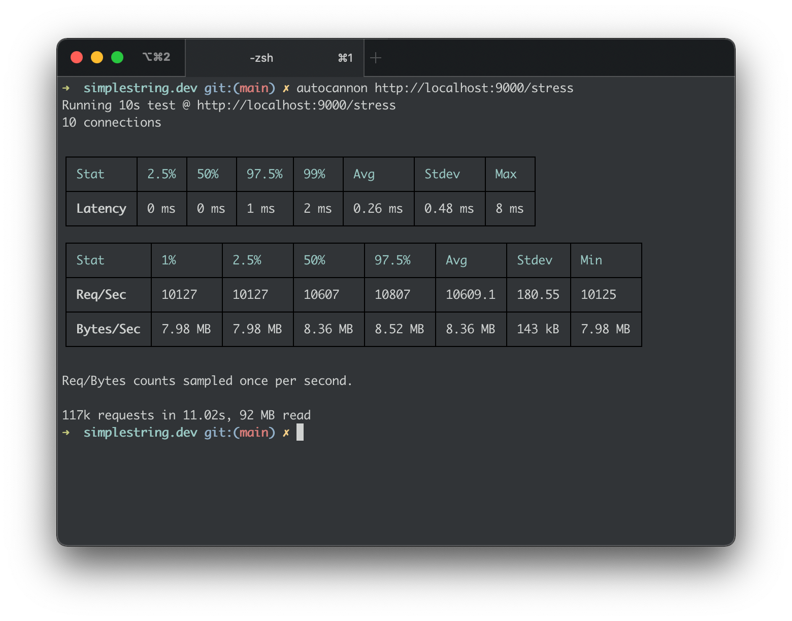

# Simple String Memory Assessment

This is a cleaned up assessment I did recently. It was very simple project that we expanded on later.

## The Original Ask

Write a long-lived service in JavaScript/NodeJS, that:

- Listens on port 9000 for incoming HTTP connections in non-blocking fashion. It must accept and handle concurrent connections with acceptable connections/second.
- The service must implement a handler that expects a string-bodied submission to the `POST /input` route. It will remember every single string submitted this way.
- The service must implement a handler at the `GET /query` route with query parameter `key`. It will check to see if it has ever seen this exact key from previous input submissions. If it hasn't seen the key before, it will return 0 (i.e. "0"). If it has seen the key before, it will return the number of times it has seen the key (e.g. "3") in the response body.

**General Guidelines**

- Don't feel you have to over-engineer the assignment. Do what feels right and sufficient for you to showcase your practical skills in both Javascript/Node.js and programming. This assignment was designed to be brief and to the point.
- Don't feel you have to write tests for testings sake. Write them if you feel they're needed to ensure correct operation.

## Getting Started

For this assignment I used the `Koa` framework to develop the API, and stored the records in memory. The Node version was `v15.7.0` and NPM was `v7.5.6`.

After cloning this repository, `cd` into the project directory and run:

```shell
> npm ci
> npm start
```

You can run tests with:

```shell
> npm test
```

## Stress Test with AutoCannon



## Scripts

There is a small script to bulk insert. You can run it from the root directory with:

```shell
> npm run insert
```

## Endpoints

| Path     | Method | Description                                                                                                                                                                                                                            |
| -------- | ------ | -------------------------------------------------------------------------------------------------------------------------------------------------------------------------------------------------------------------------------------- |
| `/`      | `GET`  | Simple status check.                                                                                                                                                                                                                   |
| `/input` | `POST` | This endpoint expects for the posted body to have the `Content-Type` of `text/plain`. If it receives anything other than a string the operation will fail and return a `500` response.                                                 |
| `/query` | `GET`  | This endpoint requires a query string param `key` that must be a string. If the string value has been posted to the `/input` endpoint it will return the number of times it has "seen" that string, or `0` if the string has not been. |
| `/all`   | `GET`  | Returns all the strings and counts.                                                                                                                                                                                                    |
